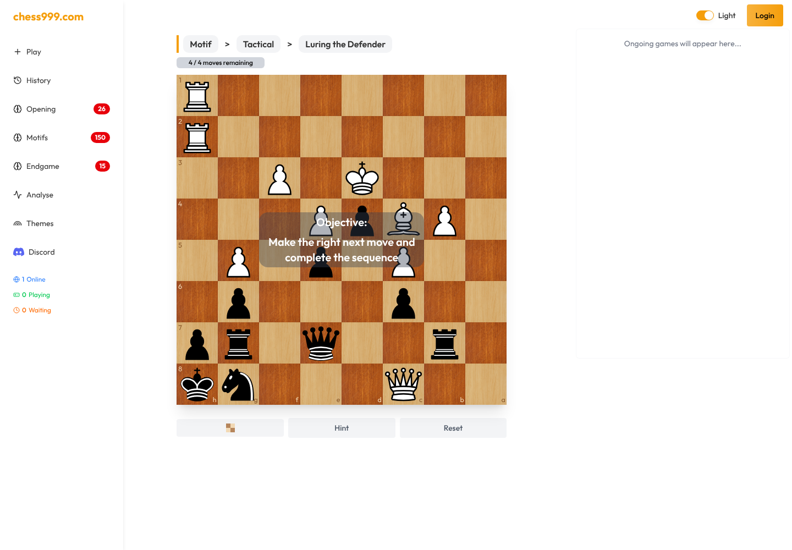
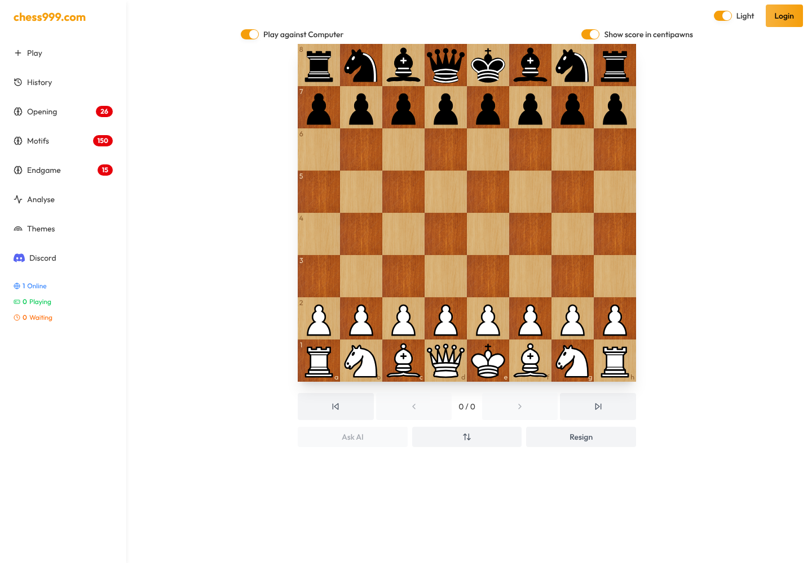
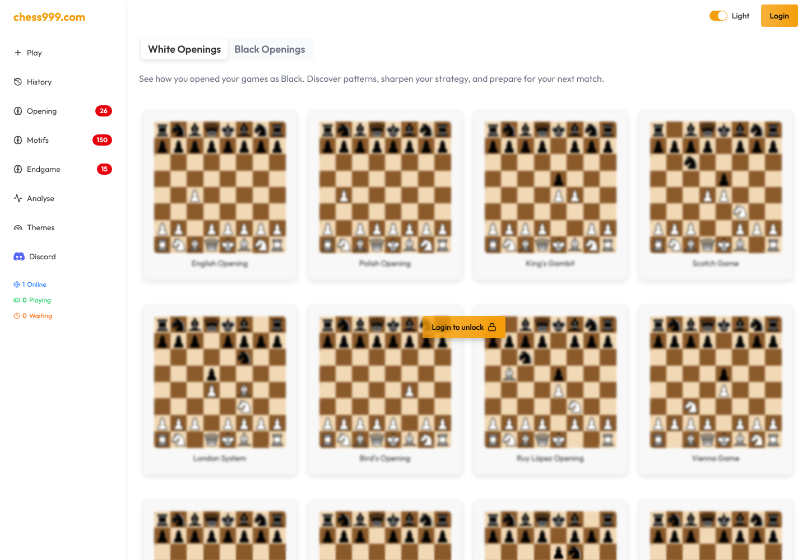

[Chess999](https://chess999.com/) is a chess training and play platform that combines interactive practice, computer analysis, online games, saved history, and imported Chess.com and Lichess activity in one application.

I worked on Chess999 from its first commit in June 2025 through July, then returned for its payment and access-control work in October 2025. Within a small team, I owned major parts of gameplay, multiplayer, external-game imports, and monetization. Other engineers made important contributions to the training libraries, profile interfaces, authentication, visual design, and OpenAI explanation flow, and the product has continued to evolve since my contribution period.

## What I contributed

My work covered several complete systems rather than one isolated feature:

- Created the original Next.js application and its first offline chess experience, using `chess.js` for game rules and Zustand for interactive game state.
- Extended the shared Stockfish integration with real-time position evaluation and move-score badges, then added history and replay controls, keyboard navigation, board orientation, persistence, highlights, and game-result handling.
- Built the core online multiplayer flow for creating and joining public or private games, sharing game links, synchronizing moves, and handling join expiry, inactivity, abandonment, and completed games.
- Implemented Chess.com and Lichess game imports with incremental progress, deduplication, batching, and platform-specific parsing. That imported data supports combined player histories and analytics.
- Built anonymous and authenticated usage limits, Stripe subscription and lifetime-payment checkout, customer-portal access, signed webhooks, and duplicate-event protection.

## Keeping gameplay state consistent

A chess interface has several representations of the same game: the `chess.js` instance, FEN position, SAN move history, visible board, persisted client state, replay position, and engine result. A bug in one transition can leave the pieces, turn indicator, evaluation, or history disagreeing with the actual game.

I worked across that lifecycle. Moves from clicks, drag-and-drop, the computer opponent, and replay navigation all had to update the same source of truth. New moves also had to clear stale evaluations, preserve useful board state, highlight checks and recent moves, play the correct sounds, and remain reversible through history controls.

Stockfish added another asynchronous layer. Engine moves and position scores arrive after the board has already changed, so results need to be associated with the correct position instead of being applied blindly to whatever is currently visible.

## Near-live multiplayer without WebSockets

Chess999's multiplayer flow uses MongoDB-backed game records and authenticated server actions. TanStack Query refreshes active game state every second, giving both players a near-live board while keeping the server as the authority for moves and lifecycle state.

The feature included more than moving pieces. I implemented public and private rooms, shareable join URLs, player assignment, move history, expiring invitations, active-player tracking, and timeout behavior for users who leave a game. Public waiting and ongoing games are also surfaced on the home screen.

## Importing external game histories

Chess.com and Lichess expose game data differently. Chess.com groups games into monthly archives, while Lichess can stream NDJSON records. I built separate ingestion paths that normalized both sources into the application's data model.

The import flow reports progress instead of freezing the interface during a large history pull. It processes records incrementally, tolerates per-batch failures, and uses unique Chess.com URLs and Lichess game IDs to prevent duplicates. The resulting data powers statistics such as results, ratings, openings, activity, opponents, and recent games.

## Technology

The application uses Next.js 15, React 19, TypeScript, MongoDB through Prisma, NextAuth, TanStack Query, Zustand, `chess.js`, `react-chessboard`, Stockfish, Tailwind CSS, Radix UI, and Stripe.

## Result

Chess999 is live and usable without an account for several practice and analysis flows. As of July 22, 2026, its public navigation showed **26 opening**, **150 motif**, and **15 endgame** training sets or exercises. These are library counts, not user totals; the site does not publish a verified total-user figure.

For me, Chess999 demonstrates full-stack ownership across a state-heavy interface, near-live collaboration, external-data ingestion, engine integration, and payment infrastructure inside one production product.

**[Visit Chess999](https://chess999.com/)**

> Chess999 is a product of Uncle Sams Tech LLC. This article describes only my contribution at a high level. The private source code is not reproduced, and the screenshots come from public, logged-out pages.
