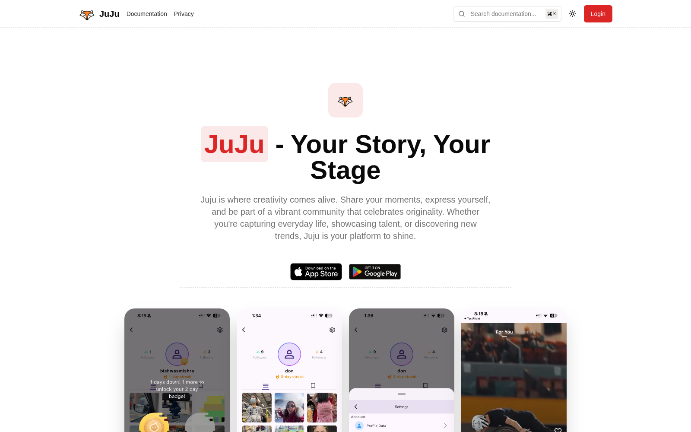
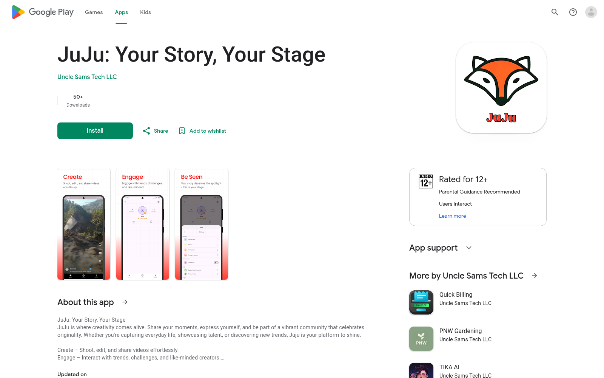

[JuJu](https://jujuconnect.com/) is a short-form video and music community published by Uncle Sams Tech LLC. Its mobile app gives creators a place to publish videos, reuse music, interact with other users, and discover content through a personalized feed.

From December 2024 to May 2025, I worked on JuJu in a backend-focused role within a small team, building most of the backend APIs and most of the admin tooling. The consumer mobile application was outside my scope.

## What I contributed

My work covered the systems behind uploading, discovering, streaming, and moderating content:

- Built and extended TypeScript and Express APIs for videos, music, tracks, uploads, hashtags, location discovery, visibility, moderation, and video and music interaction states; integrated blocked-user filtering into feed retrieval.
- Co-developed the recommendation service and expanded its feed orchestration, interaction-based ranking, Redis caching, trending and recent fallbacks, music-feed selection, and watched, rejected, and blocked-content filtering.
- Built a separate video post-processing service that moved uploads into Cloudflare Stream, extracted reusable audio with FFmpeg, stored media in Cloudflare R2, and tracked processing states.
- Implemented backend support for **Cloudflare-powered live streams** and their interactions, including playback data, reactions, comments, and viewer activity.
- Built moderation APIs and contributed admin workflows for reviewing reported videos, music, tracks, and user accounts.
- Worked across the main API, recommendation service, media processor, admin server, and React admin client inside a Turborepo monorepo.

This was collaborative work. My contribution was concentrated in the backend and APIs, and I did not build the consumer mobile application.

## How the recommendation flow worked

The recommendation system needed to serve both signed-in users and guests without running an expensive catalog-wide ranking operation for every request.

It used a staged pipeline:

1. **Collect signals.** Watch duration, full watches, loops, likes, comments, shares, and bookmarks described how strongly a person engaged with a video. Very short watches acted more like skips than positive interest.
2. **Generate candidates.** The service looked up precomputed neighbor candidates for videos in recent watch history, narrowing the pool before ranking.
3. **Rank by intent.** It adjusted stored neighbor scores using the viewer's weighted interaction with each seed video, then sorted and deduplicated the resulting candidates.
4. **Apply safety filters.** Personalized candidates were filtered against watch history and moderation-rejected videos; for signed-in users, the service also applied blocked-creator filtering.
5. **Handle cold starts.** When personalized candidates were limited, the feed filled the gap with trending and recent videos. Trending scores used engagement plus time decay so older content did not remain dominant forever.

Redis cached watch history and recommendation candidates for both authenticated and guest sessions. That reduced repeated database work while still allowing the feed to be recalculated as new interactions arrived.

The hardest part was not the scoring formula by itself. It was coordinating personalization, cold-start behavior, moderation rules, and caching inside one predictable feed lifecycle.

## Moving uploaded video into playback

Video uploads also needed more than a database record. The API issued signed Cloudflare R2 upload URLs, created the video record, and handed post-processing to a separate service.

That service transferred the video to Cloudflare Stream for transcoded playback and thumbnail delivery. When requested, it used FFmpeg to detect and extract audio, stored that audio in R2, and linked it back to the video for reuse. The main API recorded pending, successful, no-audio, and failed states instead of treating processing as one opaque request.

Separating this workflow kept media-specific work away from the main request path and made incomplete processing visible to the application.

## Moderation and administration

A social platform also needs tools for what should not appear in the feed. The backend accepted reports for videos, music, tracks, and accounts. The admin system exposed pending, cleared, and rejected states, while final rejection records fed back into content retrieval and recommendation filters. Account moderation also supported suspension workflows.

I contributed to both these APIs and their React admin experience. That work connected backend rules to an interface moderators could actually use.

## Technology

The systems I worked on used TypeScript, Node.js, Express, MongoDB with Mongoose, Redis, Zod, Cloudflare Stream, Cloudflare R2, FFmpeg, React, TanStack Query, TanStack Router, and Turborepo.

## Result

JuJu shipped on both [Google Play](https://play.google.com/store/apps/details?id=com.unclesamtech.jujuyr) and the [App Store](https://apps.apple.com/us/app/juju-your-story-your-stage/id6741166084). As of July 21, 2026, Google Play publicly showed **50+ downloads**; Apple does not publish an install total.

For me, the project was practical experience in building the systems behind a media product: APIs, personalized retrieval, caching, asynchronous processing, moderation, and operational state—not only the visible mobile interface.

**[Visit JuJu](https://jujuconnect.com/)** · **[App Store](https://apps.apple.com/us/app/juju-your-story-your-stage/id6741166084)** · **[Google Play](https://play.google.com/store/apps/details?id=com.unclesamtech.jujuyr)**

> JuJu is a product of Uncle Sams Tech LLC. This article describes only my contribution at a high level; the private source code is not reproduced, and the images come from JuJu's public website and store listings.
