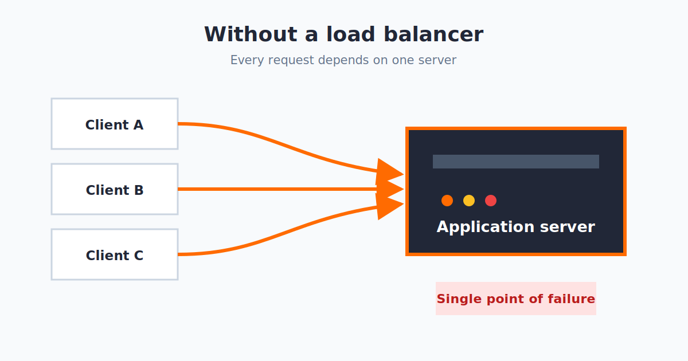
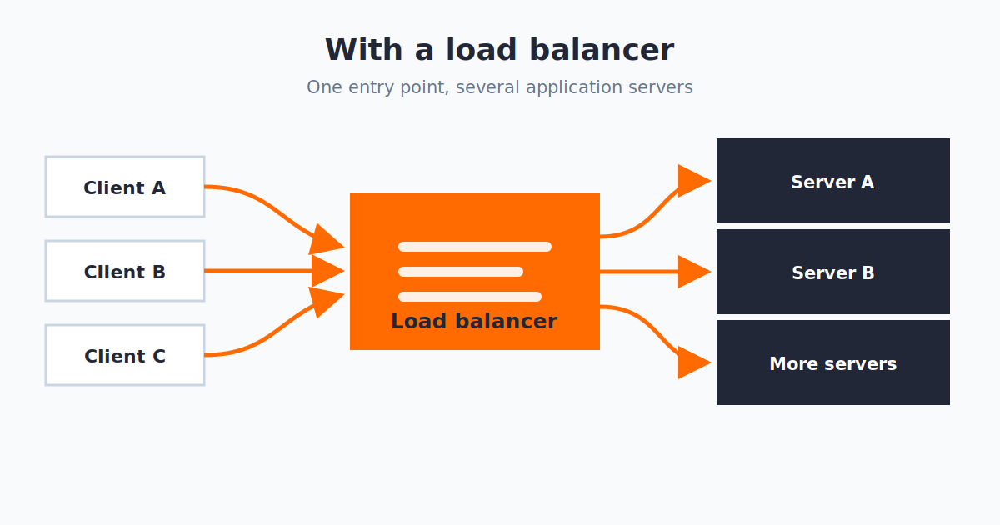

A load balancer sits between clients and application servers. It accepts a request, chooses a backend, forwards the request, and returns the response. Clients use one entry point even when several servers are working behind it.

One server is often enough when an application is small. As traffic grows, that machine can run out of CPU, memory, or network capacity. It also becomes a single point of failure because every request depends on it.

## Without a load balancer

When clients connect directly to one application server, all traffic reaches the same place:



Starting another server gives us more capacity, but clients still need a consistent way to reach them. A load balancer becomes the shared entry point and decides which server receives each request.

## With a load balancer

The traffic now has one entry point and several possible destinations:



The backends may be separate processes on one machine, different physical servers, or servers in different locations. Each one can run the same application without knowing about the others.

The basic request flow stays the same:

1. Receive a request from the client.
2. Select a server using a load-balancing method.
3. Send the request to that server.
4. Return the server's response to the client.

We will keep the server setup shared, then implement round robin and least connections as separate load balancers.

## Create `servers.ts`

The following file starts three local servers. They represent the physical servers that would normally run on separate machines. Each one has a fixed response delay and its own request counter.

```ts file="servers.ts"
const SERVERS = [
  { port: 5679, delay: 600 },
  { port: 5680, delay: 400 },
  { port: 5681, delay: 200 },
];

SERVERS.forEach((config, index) => {
  let requestCount = 0;

  const server = Bun.serve({
    routes: {
      "/": async () => {
        requestCount++;
        console.log(`Request #${requestCount} received by server ${index}`);

        await Bun.sleep(config.delay);
        return new Response(`OK from server ${index}\n`);
      },
    },
    port: config.port,
  });

  console.log(`Server ${index} running at ${server.url}`);
});
```

`Bun.sleep` gives each server a consistent processing time. The delays are deliberately different so the least-connections example has something meaningful to measure.

Start all three servers in one terminal:

```sh
bun run servers.ts
```

## Method 1: Round robin

Round robin sends each request to the next server in the list. After reaching the final server, it returns to the beginning.

```text
Request 1 → Server A
Request 2 → Server B
Request 3 → Server C
Request 4 → Server A
```

This method needs only an array and a counter. It does not check which server is busy; every server receives its turn in a fixed order.

Create `round-robin.ts`:

```ts file="round-robin.ts"
const PHYSICAL_SERVERS = [
  "http://localhost:5679",
  "http://localhost:5680",
  "http://localhost:5681",
];

let serverToRequest = 0;
let requestCount = 0;

const server = Bun.serve({
  routes: {
    "/": () => {
      const target = PHYSICAL_SERVERS[serverToRequest]!;
      requestCount++;

      console.log(`Request #${requestCount} redirected to ${target}`);

      serverToRequest = (serverToRequest + 1) % PHYSICAL_SERVERS.length;
      return Response.redirect(target);
    },
  },
  port: 5678,
});

console.log(`Load balancer running at ${server.url}`);
```

The modulo calculation makes the selected array position repeat as `0, 1, 2, 0, 1, 2`. This example responds with a redirect, so the client follows the selected server's URL. It keeps the round-robin decision easy to see.

Start it in another terminal:

```sh
bun run round-robin.ts
```

Use `-L` so `curl` follows each redirect:

```sh
for request in {1..9}; do
  curl -Ls http://localhost:5678
done
```

The output cycles through servers `0`, `1`, and `2`. The load balancer logs all nine decisions, while each server logs that it received three requests.

## Method 2: Least connections

Round robin does not know whether a server is still busy. Least connections keeps an active-request counter for every server and selects the one with the lowest value.

If one server is handling two requests while the others are handling one, the next request goes to one of the less busy servers. Its counter increases before forwarding and decreases when the request finishes.

Stop `round-robin.ts`, then create a separate `least-connections.ts`:

```ts file="least-connections.ts"
type PhysicalServer = {
  url: string;
  active: number;
};

const PHYSICAL_SERVERS: PhysicalServer[] = [
  { url: "http://localhost:5679", active: 0 },
  { url: "http://localhost:5680", active: 0 },
  { url: "http://localhost:5681", active: 0 },
];

let requestCount = 0;

const server = Bun.serve({
  routes: {
    "/": async () => {
      const target = PHYSICAL_SERVERS.reduce((leastBusy, current) =>
        leastBusy.active <= current.active ? leastBusy : current
      );

      requestCount++;
      target.active++;

      console.log(
        `Request #${requestCount} sent to ${target.url} ` +
          `(${target.active} active)`
      );

      try {
        return await fetch(target.url);
      } catch {
        return new Response("Backend unavailable", { status: 502 });
      } finally {
        target.active--;
      }
    },
  },
  port: 5678,
});

console.log(`Load balancer running at ${server.url}`);
```

This version uses `Bun.serve` for the incoming route and the built-in `fetch` API to contact the selected server. The `finally` block reduces the counter whether the request succeeds or fails.

Start it on the same load-balancer port:

```sh
bun run least-connections.ts
```

Least connections is easier to observe when requests overlap. This loop sends twelve requests with a small gap between them:

```sh
for request in {1..12}; do
  (curl -s http://localhost:5678; echo) &
  sleep 0.1
done
wait
```

The first request chooses the first server because every counter begins at zero. Later requests use whichever server has the lowest active count. Since the servers have different fixed delays, the faster server becomes available sooner and can accept more work.

## Choosing between them

Round robin is simple and predictable. It works well when servers have similar capacity and requests take roughly the same amount of time.

Least connections uses a little more state, but it responds better when request durations vary. This example only tracks active requests; it does not measure CPU, memory, or response latency.

Both implementations stay intentionally small. Health checks, retries, and failure recovery can be added separately without changing the basic selection ideas shown here.
