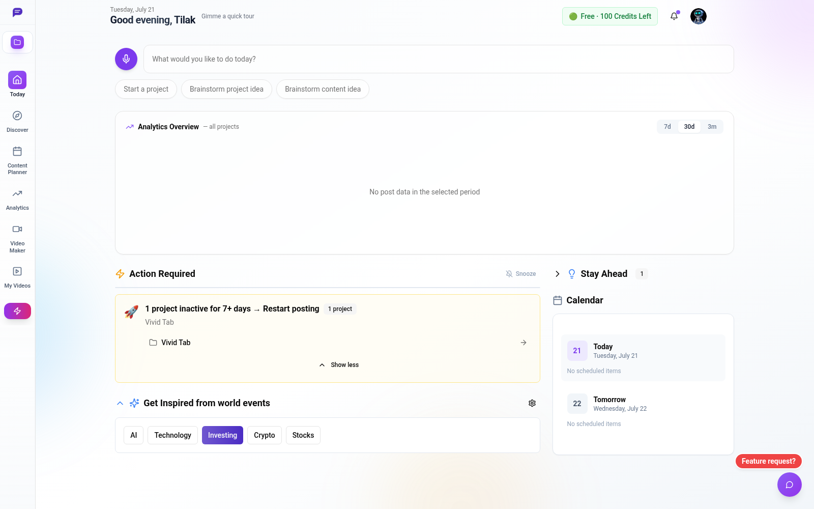
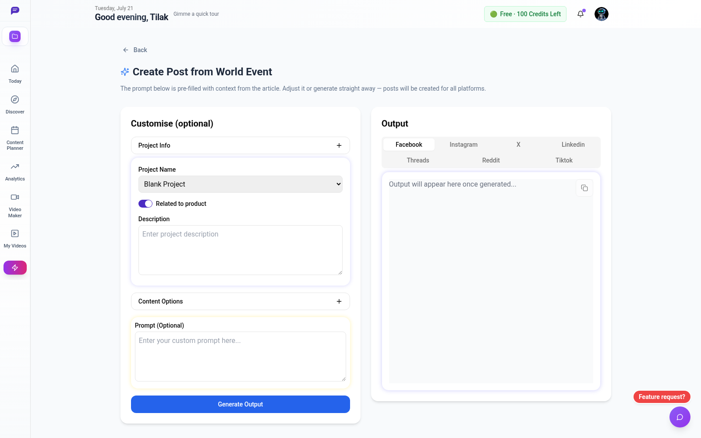

[NextPostAI](https://www.nextpostai.com/) is an AI-assisted social media marketing platform owned by Uncle Sams Tech LLC. It turns product context into campaigns and platform-specific posts, schedules them for publishing, and brings the workflow into one dashboard.

From March to October 2025, I worked on NextPostAI as a backend-heavy full-stack developer at Uncle Sams Tech. It was a collaborative product, but I built its original application foundation and was responsible for major parts of the AI generation, social publishing, scheduling, data, and billing systems.

## What I contributed

My work covered the path from creating a project to generating, scheduling, and publishing its content:

- Built the early Next.js application foundation, including authentication, sessions, middleware, project management, and the first AI content workflows.
- Developed the Gemini-powered generation pipeline for producing platform-specific content from project and campaign context.
- Implemented automatic publishing for X, Facebook Pages, Threads, and Reddit, plus the persistent scheduling flow that mapped accounts, dispatched posts, and tracked publishing states and errors.
- Co-built the campaign planner across its backend and interface, including platform selection, campaign-day generation, media handling, and responsive workflows.
- Migrated the data layer from Mongoose to Prisma while retaining MongoDB Atlas.
- Contributed to Stripe checkout, subscriptions, trials, webhooks, and payment-completion flows.
- Built product UI around campaigns, scheduled posts, account connections, media, pricing, and billing.

Other engineers contributed important frontend, analytics, and platform work. The product has continued to evolve since my contribution period, so its current interface also contains features built by the wider team.

## Unifying four different publishing APIs

The hardest engineering problem was making several third-party publishing APIs behave like one coherent workflow.

Each platform had a different OAuth flow, permission model, account structure, token lifetime, media process, and review requirement. A connection that worked in development could still fail in production until the application had the correct scopes, verification material, and approved use cases. Understanding each provider's documentation and working through its production requirements—including app review where required—was as important as writing the integration itself.

I kept platform-specific behavior behind separate publishing paths while giving the application a shared lifecycle. A scheduled post was stored first, picked up when due, matched to the correct connected account, routed to its provider, and then updated with its publishing state and any useful failure details.

That shared lifecycle still allowed provider-specific behavior. X required token-lifecycle handling, Facebook published through Pages, and Threads media could remain in an asynchronous processing state before completion. Treating those differences explicitly made failures visible and diagnosable instead of letting them disappear inside a generic “post failed” response.

## Supporting the complete product

The publishing pipeline was only one part of the system. The AI layer generated content concurrently for selected platforms and handled Gemini rate limits and temporary service failures. Campaign planning joined those generated posts into a multi-day workflow, while Cloudflare R2 supported media storage and Stripe handled subscriptions and product billing.

On the frontend, I worked on the campaign planner, scheduling interface, post previews, connected-account experience, and payment flows. This meant I worked across complete user journeys rather than isolated endpoints.

## Technology

The stack I worked with included Next.js 14, React, TypeScript, MongoDB Atlas through Prisma, NextAuth, Google Gemini, Stripe, and Cloudflare R2. On the interface, I used TanStack Query, React Hook Form, Zod, Tailwind CSS, and Radix UI.

## Result

NextPostAI became a live production SaaS, and its public product counter reported 181 registered users as of July 21, 2026. It gave users one workflow for moving from a product idea to generated campaigns and scheduled posts across several social platforms.

This project taught me that reliable integrations are built around boundaries: each provider keeps its own rules, while the product supplies a consistent workflow, persistent state, and enough observability to understand what happened.

**[Visit NextPostAI](https://www.nextpostai.com/)**

> NextPostAI and its source code are the property of Uncle Sams Tech LLC. This article describes only my contributions and the system at a high level. The source is private, and the screenshots contain no customer data.
