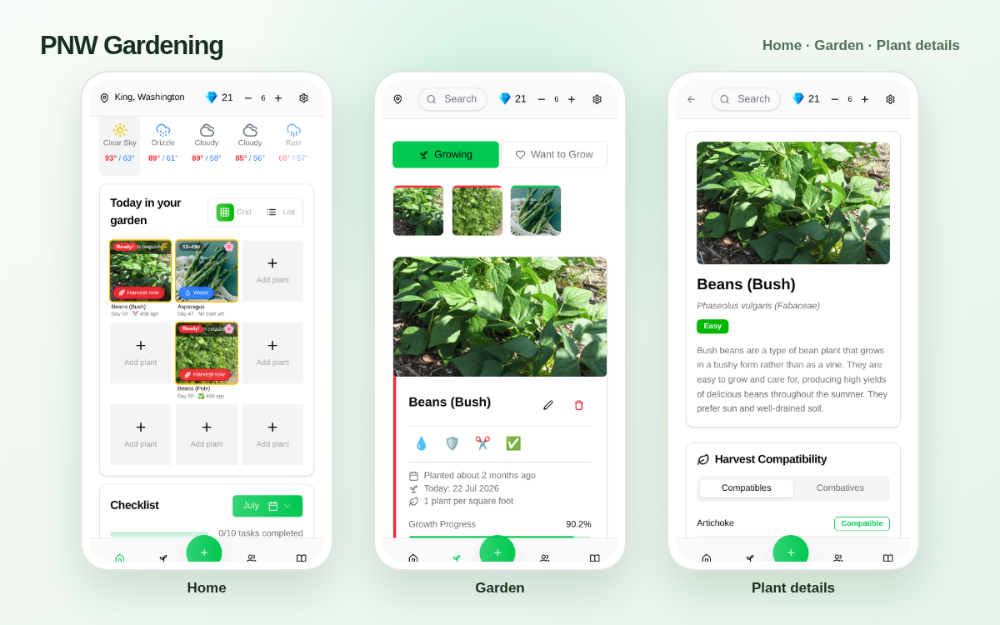

[PNW Gardening](https://www.pnwgardening.app/) is a mobile-first companion for Pacific Northwest growers. It brings local weather, planting records, garden notes, and practical plant information into one focused experience.

From May to August 2025, I led the initial Next.js web implementation as the project's primary web application developer. I created the application foundation and built many of its core user journeys, from authentication and onboarding to the garden dashboard and plant details. Other engineers contributed to the product, and the separate native clients were outside my scope.

## What I built

My work covered both the interface and the Supabase-backed data flows behind it:

- Set up the Next.js application and implemented email authentication, password recovery, guest access, profiles, and ZIP-code onboarding.
- Built the mobile-first home dashboard with location-aware weather, garden summaries, upcoming harvests, and monthly gardening tasks.
- Developed the searchable plant directory and detailed plant pages covering planting cycles, hardiness, temperature, soil, growth, and companion relationships.
- Built personal garden flows for growing and wish-list states, planting dates, planting density, grid position, notes, and calculated harvest windows—including perennial plants.
- Implemented early community features including image posts, likes, comments, user blocking, and email notifications.
- Worked across responsive UI, TanStack Query hooks, Supabase queries, validation, and account settings rather than treating the frontend and data layer as separate projects.

## Turning several data sources into one simple flow

The main challenge was making weather, plant reference data, and each gardener's own records feel like one small, understandable app.

The home screen uses a saved ZIP code to load the gardener's location and hardiness information, then requests local conditions from Open-Meteo. Planting dates and plant-specific growth rules feed the harvest calculations. The garden view turns those results into visible progress and upcoming harvests, while each plant page keeps the underlying botanical details and personal notes close at hand.

That data model had to support two different intentions: plants someone was already growing and plants they wanted to grow later. It also needed to behave well inside a narrow mobile viewport, so I spent time on drawers, search behavior, touch-friendly controls, body-scroll handling, and responsive layouts.

## Technology

The web application uses Next.js 15, React, TypeScript, Tailwind CSS, and Radix-based UI components. TanStack Query manages client-side queries and mutations, while Supabase provides authentication, Postgres-backed product data, and image storage. Open-Meteo supplies weather data, and Brevo supports transactional email notifications.

## Result

PNW Gardening is available on the web, Android, and iOS. As of July 22, 2026, [Google Play](https://play.google.com/store/apps/details?id=com.unclesamtech.pnwg) publicly showed **100+ downloads**, while the US [App Store](https://apps.apple.com/us/app/pnw-gardening/id6745737857) showed a **5.0 rating from 2 ratings**. Apple does not publish an install total.

The project is a compact example of my full-stack work: taking a practical domain, structuring its data, and turning it into a responsive product that people can use on the web and through mobile apps.

**[Visit PNW Gardening](https://www.pnwgardening.app/)** · **[App Store](https://apps.apple.com/us/app/pnw-gardening/id6745737857)** · **[Google Play](https://play.google.com/store/apps/details?id=com.unclesamtech.pnwg)**

> PNW Gardening is a product of Uncle Sams Tech LLC. This article describes only my contribution at a high level. The current product has continued to evolve with work from other engineers, and the screenshots use a private development account with no customer data.
