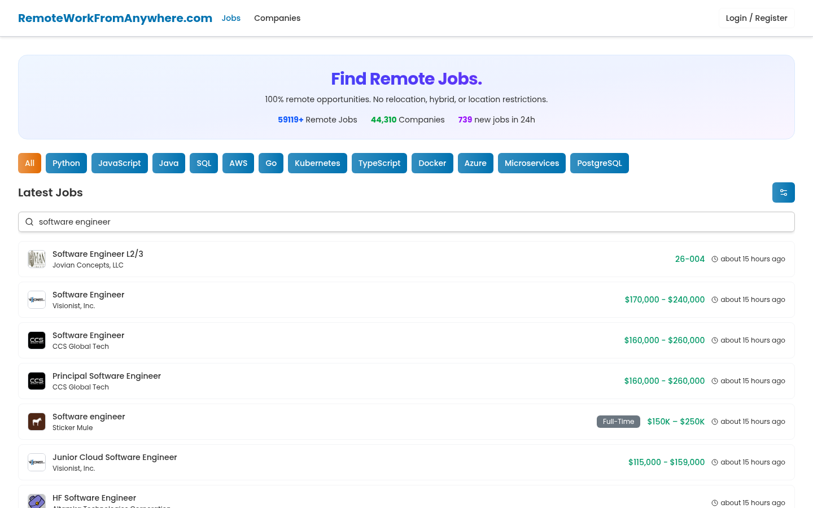
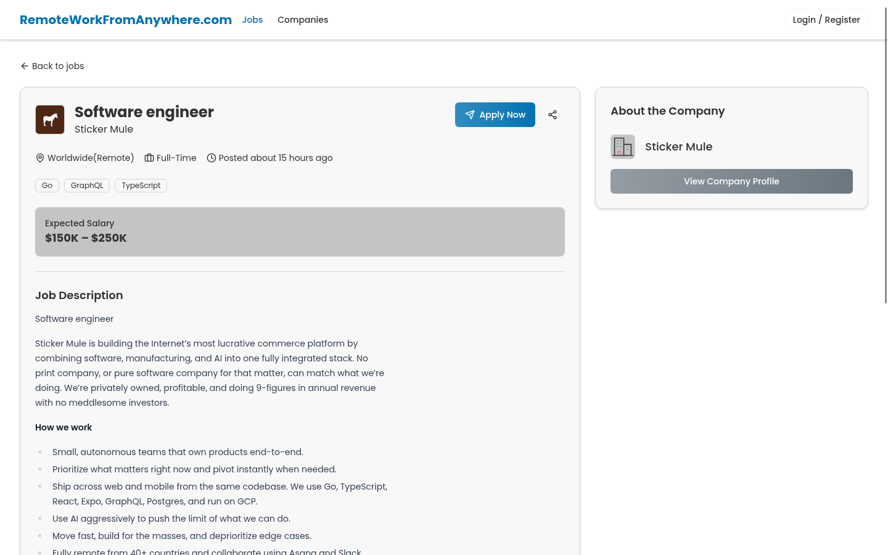

[RemoteWorkFromAnywhere](https://www.remoteworkfromanywhere.com/) is a production job-search platform that gathers listings from multiple sources and presents them as a searchable, remote-focused board with external application links.

I worked on the product in May and September 2025 as a full-stack developer on a three-person engineering team. I created the original monorepo and application foundation, built much of the first version of the job board and ingestion pipeline, and later returned to improve scraper reliability and add more sources. My teammates extended the pipeline and built later account, application, resume-generation, and billing features, so the current product reflects shared work.

## What I contributed

My work covered the route from an external listing to a job that someone could find and open on the site:

- Established the original pnpm and Turborepo workspace with a Next.js application, MongoDB and Prisma data layer, and separate TypeScript services for extraction and scheduling.
- Built the initial job-list, job-detail, and company experiences, including React Query data fetching, loading states, debounced keyword search, skill and date filters, paginated and incremental loading, external application links, and sharing.
- Implemented the first LinkedIn and RealWorkFromAnywhere extractors, then later built Python integrations for Indeed, ClearanceJobs, and Wellfound and strengthened the LinkedIn extraction flow.
- Mapped relative dates, salary text, skills, tags, company records, and source application URLs into a shared schema before listings reached the public board.
- Implemented an early, inspectable ruleset that flagged and hid descriptions matching explicit hybrid, relocation, residency, and work-eligibility restrictions.
- Introduced the separate scheduler that ran the extraction and parsing flow in four-hour batches, along with early email-alert and Discord-notification integrations.

## Making different sources behave like one system

The difficult part was not rendering a list of jobs. It was mapping several changing websites into one shared data model.

Every source exposed different markup, pagination, date formats, company information, and link behavior. Some pages needed browser automation, while others could be parsed from HTML or accessed through a source-specific library. A listing URL was not always the source's application URL, and a role labelled “remote” could still contain a location restriction inside its description.

I kept extraction source-specific and normalization shared. The TypeScript service used Hono, Puppeteer, Cheerio, throttling, and browser-stealth techniques. Later Python integrations used FastAPI, Playwright, Beautiful Soup, and JobSpy where those tools fit the source better. Parsed records were upserted into a common Prisma schema so the web application did not need to know where each job originated.

The remote-role check was deliberately inspectable rather than presented as AI. It looked for clear exclusion signals such as hybrid work, relocation, and country-specific residence requirements, while recognizing stronger phrases such as “work from anywhere” and “fully remote.” It was an early ruleset—not a guarantee that every source record was correct—but its decisions were easy to inspect and adjust as new wording appeared.

## Keeping a data-heavy board usable

The board depends on database queries and background-enriched data, so loading behavior mattered. I introduced React Query and visible loading states, then built debounced search and paginated filtering so users could refine the dataset without every keystroke becoming a new request.

The job-detail flow preserved the source application URL and handed users off to it while presenting mapped metadata and company context in one place. The company directory reused the same data model and loaded additional records incrementally.

## Technology

The parts I worked on used Next.js, React, TypeScript, TanStack Query, MongoDB, Prisma, Hono, Puppeteer, Cheerio, Python, FastAPI, Playwright, Beautiful Soup, JobSpy, Brevo, and a separate Node.js scheduler inside a pnpm/Turborepo monorepo.

## Result

RemoteWorkFromAnywhere remains live as a public, no-login job-discovery experience. On July 22, 2026, its homepage displayed counters of **59,119+ job records**, **44,310 companies**, and **739 records added in the previous 24 hours**. These are changing catalog counters, not verified active-opening, user, or placement totals.

For me, the project demonstrates full-stack ownership across product UI, data modeling, web extraction, normalization, scheduled processing, and the operational details required to keep several external sources behind one consistent interface.

**[Explore RemoteWorkFromAnywhere](https://www.remoteworkfromanywhere.com/)**

> RemoteWorkFromAnywhere is a product of Uncle Sams Tech LLC. This article describes only my contribution at a high level. The private source code is not reproduced, the product has continued to evolve with work from other engineers, and the screenshots come from public logged-out pages captured on July 22, 2026.
