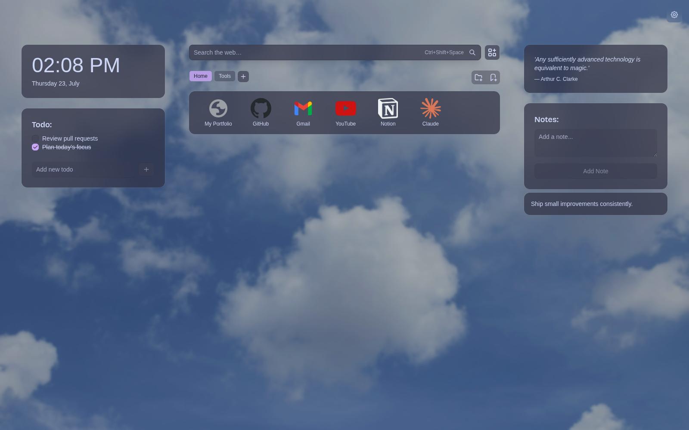
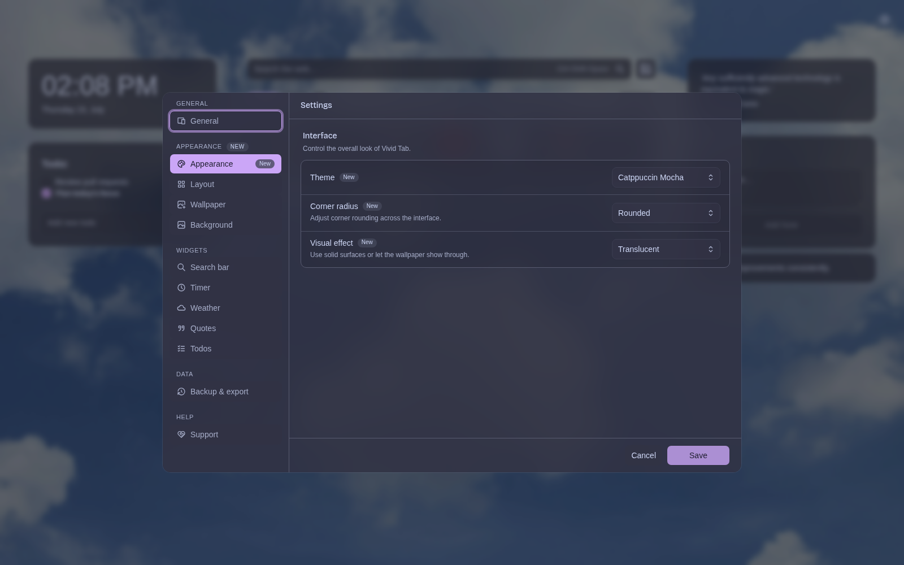
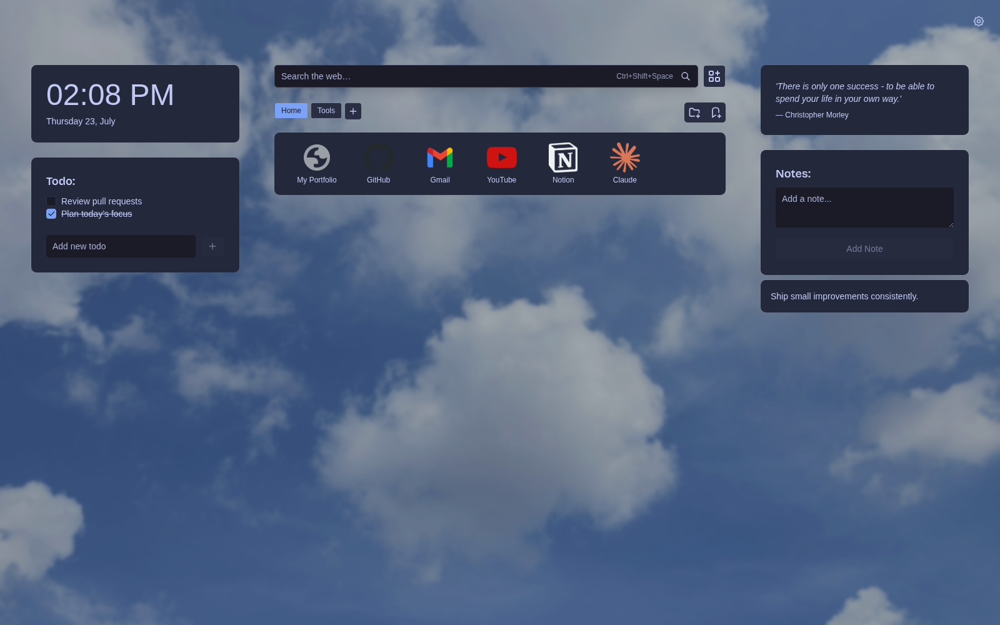

[Vivid Tab](https://vividtab.jrtilak.dev/) is a free, open-source browser extension that turns a new tab into a personal dashboard for bookmarks, search, notes, to-dos, quotes, weather, and wallpapers. I designed and built it as a solo product, then released it for both Chromium-based browsers and Firefox.

## Why I built it

I wanted a new-tab page that felt like a small workspace: my actual browser bookmarks in the center, a fast search bar, a few useful widgets, and enough visual control to make it feel personal.

I had used another new-tab product before, but the versions that matched what I wanted placed useful features behind a paid plan. Paying repeatedly for a focused browser utility this simple did not make sense to me, so in January 2025 I started building my own.

Vivid Tab was initially just for me. Once I released it publicly, people began using it and the early feedback was positive, so I kept improving it as a real product rather than leaving it as a one-off side project.

## What I built

- A bookmark dashboard backed by the browser's real bookmark tree, with selectable root folders, nested navigation, grid and list layouts, drag-and-drop organization, editing, custom icons, and local-file links.
- Bang search for jumping directly to services with shortcuts such as `!g`, `!yt`, and `!gh`, plus a keyboard command that opens search from the new-tab page.
- Configurable clock, weather, quotes, to-do, and notes widgets that can be rearranged around the bookmark area.
- Dark, Catppuccin Mocha, and Tokyo Night themes, along with corner-radius and translucent or opaque surface controls.
- Uploaded and online wallpapers with caching, bookmarking, selection, brightness, blur, and automatic rotation controls.
- Guided onboarding, settings import and export, preference migration, privacy and legal pages, and separate release packages for Chromium and Firefox.

## Keeping browser bookmarks as the source of truth

I did not want Vivid Tab to become another isolated bookmark database. Users choose a real browser bookmark folder, and the extension renders and manages that folder directly through the WebExtensions bookmark API.

That choice makes the product more useful, but it also creates harder edge cases. A saved root folder can be renamed or deleted outside the extension. Bookmark trees contain folders, URLs, and browser-owned roots with different shapes. Moving and editing entries must update the browser correctly, while custom icons need separate storage because bookmark records do not contain that data.

Vivid Tab resolves or repairs the configured root when needed, keeps folder navigation in browser storage, and separates custom icon state from the bookmark itself. Users keep ownership of their normal bookmarks instead of having to import them into a proprietary format.

## Building for Chromium and Firefox

Vivid Tab ships through both the [Chrome Web Store](https://chromewebstore.google.com/detail/vivid-tab/hchlkclbagoklpnijoadpghhcjpeoeim) and [Firefox Add-ons](https://addons.mozilla.org/en-US/firefox/addon/vivid-tab/). The shared React application is packaged as separate Manifest V3 targets, but cross-browser support required more than changing a build flag.

Chromium exposes a cached favicon endpoint to extensions; Firefox does not, so Vivid Tab uses a different favicon fallback path there. Permissions and manifest fields also differ. Remote search suggestions are intentionally disabled in Firefox to respect Mozilla's search-transmission policy, while the rest of the search experience remains shared.

The repository includes common browser journeys for both targets, covering onboarding, new-tab behavior, settings, bookmarks, and stored preferences. Keeping the scenarios shared helps prevent the two browser versions from silently drifting apart.

## Making customization reliable

Customization touches nearly every surface, so it cannot be implemented as a collection of unrelated CSS toggles. Theme, radius, transparency, layout, widgets, and wallpaper behavior are stored as one validated, versioned settings model.

When that model changes, older preferences are normalized and migrated instead of discarded. Invalid settings fall back safely, and user-controlled wallpaper files live in IndexedDB rather than being forced into synchronized browser storage.

The wallpaper flow also preserves uploaded and bookmarked images while refreshing replaceable online results. Images are cached before the visible set changes, which avoids turning every new tab into a fresh network request.

## A focused tool instead of a crowded dashboard

The goal was not to add every possible widget. The dashboard stays centered on the actions I repeat most: opening a bookmark, searching, checking a short task list, saving a note, or changing the atmosphere with a wallpaper.

Bang search follows the same idea. A query such as `!gh browser extension` goes directly to GitHub, while normal text uses the browser's default search engine. Quotes are bundled locally, and weather is cached, so the page remains useful when a provider is temporarily unavailable.

The interface can be rearranged without changing the underlying data. This Tokyo Night example uses the same bookmarks and widgets as the earlier screenshot, but switches to smaller corners and opaque surfaces.

## Technology

The extension uses React 19, TypeScript, Plasmo, Tailwind CSS, Radix UI, `dnd-kit`, Zod, browser storage APIs, the bookmarks API, and IndexedDB. Unit tests cover the state and storage logic, while WebdriverIO drives shared Chromium and Firefox browser scenarios. The public product website is built with Astro.

## Result

Vivid Tab grew from a tool I built for myself into a maintained, public extension with real users on two browser platforms. As of July 23, 2026, the Chrome Web Store showed **88 users** and a **5.0 rating from five ratings**. The project is also public on GitHub, where users can inspect the implementation, report issues, and contribute.

For me, the project demonstrates more than a polished React interface. It shows long-term product ownership across browser APIs, cross-browser differences, local-first storage, data migration, release packaging, testing, documentation, and the steady maintenance required after people begin relying on something.

**[Install for Chrome](https://chromewebstore.google.com/detail/vivid-tab/hchlkclbagoklpnijoadpghhcjpeoeim)** · **[Install for Firefox](https://addons.mozilla.org/en-US/firefox/addon/vivid-tab/)** · **[View the source](https://github.com/jrtilak/vivid-tab)**

> Vivid Tab is my personal open-source project. The screenshots show the current interface using a clean demo browser profile with public bookmarks and no private user data. Store figures are a dated snapshot and may change.
